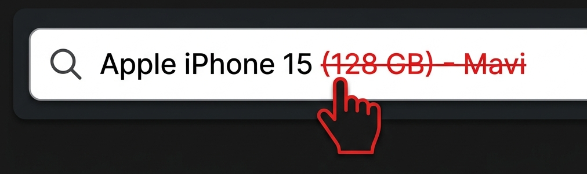

## Akakçe'de İncele

Herhangi bir e-ticaret sitesinde ürün sayfasındayken uzantıya tıklayarak ürünün Akakçe fiyat karşılaştırma sayfasını yeni sekmede açın. Ürün başlığı otomatik olarak tespit edilir ve panoya kopyalanır.

### Özellikler

- 🖱️ **Tek tıkla arama** — Uzantı ikonuna tıkladığınızda ürün sayfasından başlık tespit edilir ve Akakçe'de arama yapılır
- ⌨️ **Klavye kısayolu** — `Alt + A` ile hızlıca tetikleyin (ayarlardan değiştirilebilir)
- 📋 **Otomatik pano kopyalama** — Ürün başlığı arama yapılırken otomatik panoya kopyalanır (ayarlardan kapatılabilir)
- 🖱️ **Sağ tık menüsü** — Herhangi bir metni seçip sağ tıklayarak "Akakçe'de Ara" seçeneğini kullanın
- 🔍 **Omnibox desteği** — Adres çubuğuna `ak` yazıp `Tab`'a basarak doğrudan arama yapın
- ✂️ **Arama Kırpıcı** — Akakçe arama çubuğundaki kelimeleri tıklayıp silerek veya geri yükleyerek aramayı düzenleyin

### Desteklenen Siteler

Amazon, Hepsiburada, Trendyol, n11, Teknosa, MediaMarkt, Pazarama, PttAVM, Turkcell, Çiçeksepeti, Migros, Gürgençler ve JSON-LD / Open Graph meta verisi içeren diğer e-ticaret siteleri.

### Gereksinimler

Chromium tabanlı bir tarayıcı gereklidir: Google Chrome, Microsoft Edge, Brave veya Opera.

### Yükle

[Chrome Web Store'dan İndir](https://chromewebstore.google.com/u/1/detail/akak%C3%A7ede-i%CC%87ncele/fpfmdjdapggifnehnnnamljnfbhioddj)